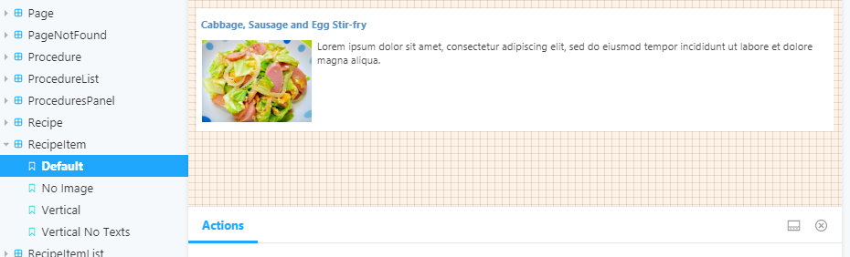
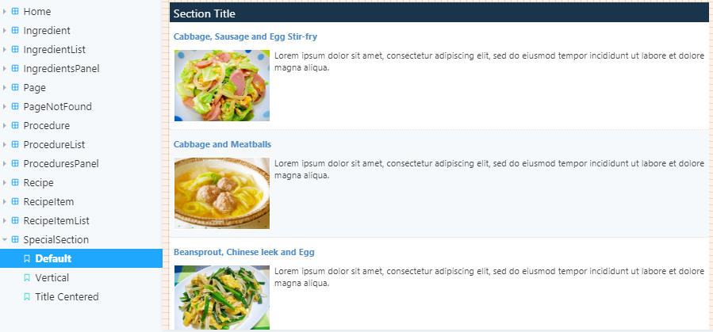
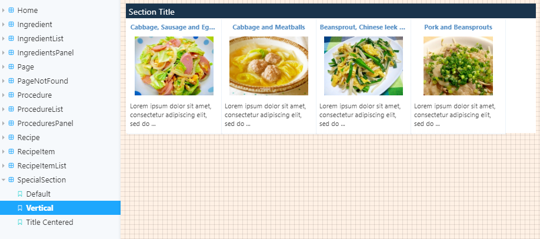

react-storybook-recipe
================

This project was bootstrapped with [Create React App](https://github.com/facebook/create-react-app).

## Description
This is a sample exercise for [Storybook](https://storybook.js.org/docs/basics/introduction/).

Basically, the application is a recipe book of dishes.
I want to apply what I am learning to some real-world *(well, kinda)* project and I do not want to make another Todo app, which is the same topic already for the [Storybook tutorial](https://www.learnstorybook.com/intro-to-storybook/react/en/get-started/).

Another reason why I chose a recipe book because I also want to make it from the ground up like a real [Component-Driven Development](https://www.learnstorybook.com/intro-to-storybook/react/en/simple-component/) (CDD) project. I like cooking so I can easily visualize it without even making any mock up plans.

~~_Note: This is a work in progress. The reason I am committing it in stages is to document the progress and demonstrate working through CDD methodology._~~

There are no events in the components. I started adding one but decided to remove it. There are still many things to study and I still have many questions of what kind of pattern/solution is apt to certain problems. Anyway, I will end this exercise at this point. I will probably make a Single Page App next to study user actions, etc. I made just two pages to use the components and redux to manage the recipe data.

RecipeItem Basic component:

SpecialSection component using RecipeItem:

The same SpecialSection component in Vertical mode:

## Available Scripts

In the project directory, you can run:

### `npm start`

Runs the app in the development mode. 
Open [http://localhost:3000](http://localhost:3000) to view it in the browser.

The page will reload if you make edits. 
You will also see any lint errors in the console.

### `npm run storybook`

Start the Storybook component explorer on port 9009.

### `npm test`

Launches the test runner in the interactive watch mode. 
See the section about [running tests](https://facebook.github.io/create-react-app/docs/running-tests) for more information.

### `npm run build`

Builds the app for production to the `build` folder. 
It correctly bundles React in production mode and optimizes the build for the best performance.

The build is minified and the filenames include the hashes. 
Your app is ready to be deployed!

See the section about [deployment](https://facebook.github.io/create-react-app/docs/deployment) for more information.

### `npm run eject`

**Note: this is a one-way operation. Once you `eject`, you can’t go back!**

If you aren’t satisfied with the build tool and configuration choices, you can `eject` at any time. This command will remove the single build dependency from your project.

Instead, it will copy all the configuration files and the transitive dependencies (webpack, Babel, ESLint, etc) right into your project so you have full control over them. All of the commands except `eject` will still work, but they will point to the copied scripts so you can tweak them. At this point you’re on your own.

You don’t have to ever use `eject`. The curated feature set is suitable for small and middle deployments, and you shouldn’t feel obligated to use this feature. However we understand that this tool wouldn’t be useful if you couldn’t customize it when you are ready for it.

## Learn More

You can learn more in the [Create React App documentation](https://facebook.github.io/create-react-app/docs/getting-started).

To learn React, check out the [React documentation](https://reactjs.org/).

### Code Splitting

This section has moved here: https://facebook.github.io/create-react-app/docs/code-splitting

### Analyzing the Bundle Size

This section has moved here: https://facebook.github.io/create-react-app/docs/analyzing-the-bundle-size

### Making a Progressive Web App

This section has moved here: https://facebook.github.io/create-react-app/docs/making-a-progressive-web-app

### Advanced Configuration

This section has moved here: https://facebook.github.io/create-react-app/docs/advanced-configuration

### Deployment

This section has moved here: https://facebook.github.io/create-react-app/docs/deployment

### `npm run build` fails to minify

This section has moved here: https://facebook.github.io/create-react-app/docs/troubleshooting#npm-run-build-fails-to-minify
